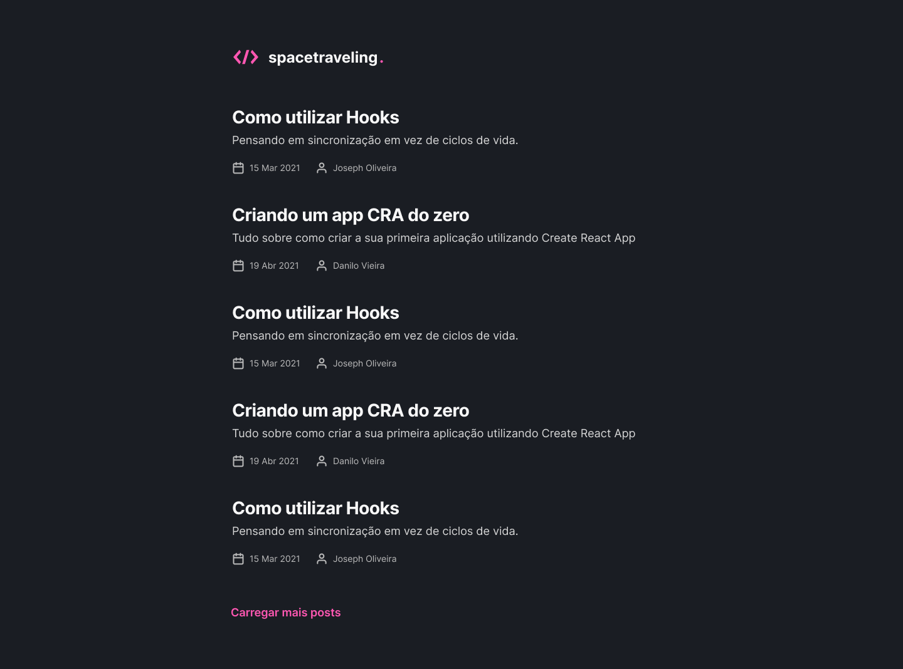

# Desafio 01 - Criando um projeto do zero

<p align="center">


</p>

<br>

<p align="center"><em>Confira o resultado do desafio em: <a href="https://spacetraveling-rocketseat-vitor.vercel.app" target="_blank">spacetraveling-rocketseat-vitor.vercel.app</a></em></p>

## :computer: Sobre o desafio

<hr>

Nesse desafio, você deverá criar uma aplicação para treinar o que aprendeu até agora no ReactJS

Essa será uma aplicação onde o seu principal objetivo é criar um blog do zero. Você vai receber uma aplicação praticamente em branco que deve consumir os dados do Prismic e ter a interface implementada conforme o layout do Figma. Você terá acesso a diversos arquivos para implementar:

- Estilizações global, comun e individuais;
- Importação de fontes Google;
- Paginação de posts;
- Cálculo de tempo estimado de leitura do post;
- Geração de páginas estáticas com os métodos `getStaticProps` e `getStaticPaths`;
- Formatação de datas com `date-fns`;
- Uso de ícones com `react-icons`;
- Requisições HTTP com `fetch`;
- Entre outros.

A seguir veremos com mais detalhes o que e como precisa ser feito 🚀

## Layout da Aplicação

<div>
  <p>Home</p>
  
   <p>Post</p>
  
</div>

## Imagens

<div>
   <p>Home</p>
   
   <p>Post</p>
   
</div>

## :rocket: Techs

<ul>
  <li> ReactJS </li>
  <li> TypeScript </li>
  <li> Next.js </li>
  <li> React Icons </li>
  <li> Prismic </li>
  <li> Sass </li>
</ul>

## Desenvolvimento

---

### Pré-requisitos

- Instalar [Node.js](https://nodejs.org)

- Instalar [Yarn](https://yarnpkg.com/)

### Clone o repositório

```bash
$ git@github.com:vitorgaletti/ignite-reactjs-spacetraveling.git
```

### Executar Projeto

```bash
# Mudar para directório
$ cd ignite-reactjs-spacetraveling/
```

- Instalar dependências

```bash
$ yarn
```

```bash
# Crie um arquivo .env.local e configure as váriaveis de ambiente
# Stripe
PRISMIC_API_ENDPOINT=
PRISMIC_ACESS_TOKEN=
```

- Execute

```bash
$ yarn dev
```

```bash
$ yarn build
```

- Executar scripts

|          Ação          |  Utilização  |
| :--------------------: | :----------: |
|   Iniciar o servidor   |  `yarn dev`  |
|    Executar testes     | `yarn test`  |
| Compilar para produção | `yarn build` |

Acesse <http://localhost:3000> para ver o resultado.
